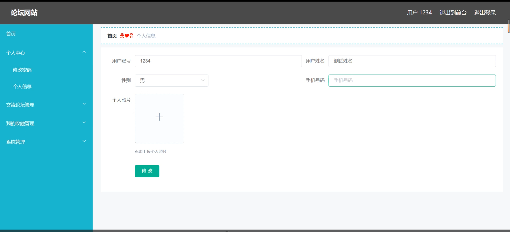

# 基于springboot的论坛网站

<h4 style='color:red'>联系不到我，就看我的主页 </h4> 
 
#### 介绍

我开发了一个基于SpringBoot的论坛网站，该系统旨在提供一个互动和交流的平台，方便用户分享知识、讨论问题和获取最新资讯。系统拥有三种角色，分别是管理端、普通管理员端和用户端，每个角色具有不同的权限和功能模块，以满足各自的需求和职责。管理端负责整个系统的运营和维护，普通管理员端负责论坛内容的管理和用户互动，而用户端则专注于参与讨论和获取信息。

#### 技术栈

后端技术栈：Springboot+Mysql+Maven

前端技术栈：Vue+Html+Css+Javascript+ElementUI

开发工具：Idea+Vscode+Navicate

#### 系统功能介绍

管理端

个人中心：管理端用户可以在个人中心查看和编辑个人信息，包括修改密码和更新联系方式，确保信息的准确性和安全性。  
用户管理：管理用户信息，包括用户的注册、删除和信息修改，确保用户数据的准确性和及时更新。  
普通管理员管理：管理普通管理员的信息，包括添加、删除和编辑普通管理员，分配其权限和职责。  
论坛类别管理：管理论坛的类别，包括添加、修改和删除论坛类别，确保论坛内容的分类合理和易于导航。  
交流论坛管理：管理交流论坛的内容，包括审核帖子、删除不当言论和维护论坛秩序。  
系统管理：进行系统配置和维护，确保系统的正常运行和安全性。  

普通管理员端  

交流论坛：普通管理员可以查看和参与论坛的讨论，与用户互动并提供帮助。  
系统资讯：获取系统的最新资讯和公告，了解系统的更新和重要通知。  
个人中心：查看和编辑个人信息，包括修改密码和更新联系方式。  
后台管理：管理论坛内容，进行帖子审核和处理用户反馈，确保论坛内容的健康和有序。  
问题反馈：接收和处理用户反馈的问题，及时解决用户遇到的困难和疑问。  

用户端  

交流论坛：用户可以在论坛中发帖和回帖，参与各种讨论，分享知识和经验。  
系统资讯：获取系统的最新资讯和公告，了解最新的动态和通知。  
个人中心：查看和编辑个人信息，包括修改密码和更新联系方式。  
后台管理：管理自己的帖子和收藏，查看和处理系统管理相关内容。  
我的收藏管理：管理用户收藏的帖子和内容，方便随时查阅。  
系统管理：查看和处理与系统相关的设置和通知。  
问题反馈：用户可以反馈在使用过程中的问题和建议，帮助系统改进和优化。  

#### 系统作用

管理端的作用

系统维护：管理端用户通过用户管理、普通管理员管理和系统管理，确保系统的正常运行和用户数据的安全。  
内容管理：通过论坛类别管理和交流论坛管理，维护论坛内容的健康和有序，确保用户的交流环境良好。  
权限管理：管理普通管理员的权限和职责，确保普通管理员的工作效率和规范性。  

普通管理员端的作用  

内容审核：普通管理员通过交流论坛和后台管理，审核帖子和处理用户反馈，确保论坛内容的质量和秩序。  
用户互动：通过交流论坛与用户互动，提供帮助和解答疑问，提升用户体验。  
信息传递：通过系统资讯，了解系统的最新动态和公告，及时传递信息给用户。  

用户端的作用  

交流互动：用户通过交流论坛参与讨论，分享知识和经验，提升自我和他人的知识水平。  
信息获取：通过系统资讯，获取最新的动态和公告，了解系统的变化和更新。  
个人管理：通过个人中心和后台管理，管理个人信息、帖子和收藏，提升使用体验。  
问题反馈：通过问题反馈，提出使用过程中的问题和建议，帮助系统改进和优化。  

#### 系统功能截图

代码结构

数据库表

登录

用户管理

普通管理员管理

论坛类别

系统管理

普通管理员后台管理

前台页面首页

用户端后台管理

问题反馈

#### 总结

基于SpringBoot的论坛网站通过角色分工和功能模块的设计，实现了用户间的交流互动和信息分享。管理端通过系统维护和内容管理，确保系统的正常运行和用户数据的安全；普通管理员通过内容审核和用户互动，维护论坛的健康和有序；用户通过交流论坛和信息获取，提升自我知识水平和使用体验。该系统不仅优化了用户的交流互动流程，还提升了用户的体验和满意度，为用户提供了一个便捷、高效的交流平台。

#### 使用说明

创建数据库，执行数据库脚本 修改jdbc数据库连接参数 下载安装maven依赖jar 启动idea中的springboot项目

后台地址：http://localhost:8080/springboot34t91/admin/dist/index.html

管理员  abo 密码 abo

前台地址：http://localhost:8080/springboot34t91/front/index.html

